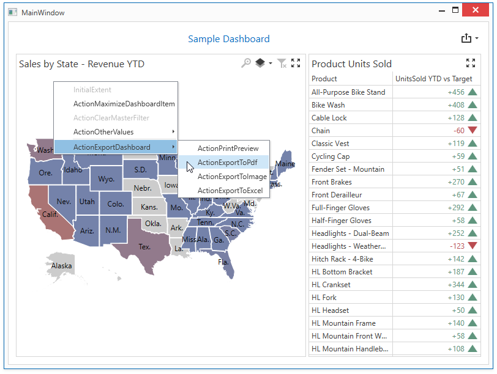

<!-- default badges list -->

<!-- default badges end -->
<!-- default file list -->
*Files to look at*:

* [MainWindow.xaml.cs](./CS/Dashboard_Wpf_Localizer_Example/MainWindow.xaml.cs) (VB: [MainWindow.xaml.vb](./VB/Dashboard_Wpf_Localizer_Example/MainWindow.xaml.vb))
* [MyDashboardLocalizer.cs](./CS/Dashboard_Wpf_Localizer_Example/MyDashboardLocalizer.cs) (VB: [MyDashboardLocalizer.vb](./VB/Dashboard_Wpf_Localizer_Example/MyDashboardLocalizer.vb))
<!-- default file list end -->

# WPF Dashboard Control - Localized String ID Visualizer

This example demonstrates how to use the [DashboardLocalizer](https://docs.devexpress.com/Dashboard/DevExpress.DashboardCommon.Localization.DashboardLocalizer) object to visualize the localizable string IDs.

# Documentation

* [Localize WPF Dashboard Control](https://docs.devexpress.com/Dashboard/400835/wpf-viewer/localization)
* [Localize WPF Controls via Localizer Objects](https://docs.devexpress.com/WPF/7543)

## More Examples

- [Dashboard for WinForms - Localized String ID Visualizer](https://github.com/DevExpress-Examples/winforms-dashboard-localize-stringid-visualizer)
